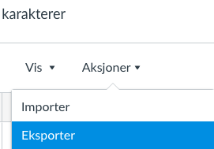
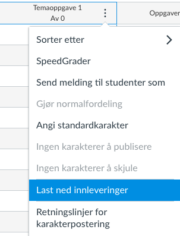
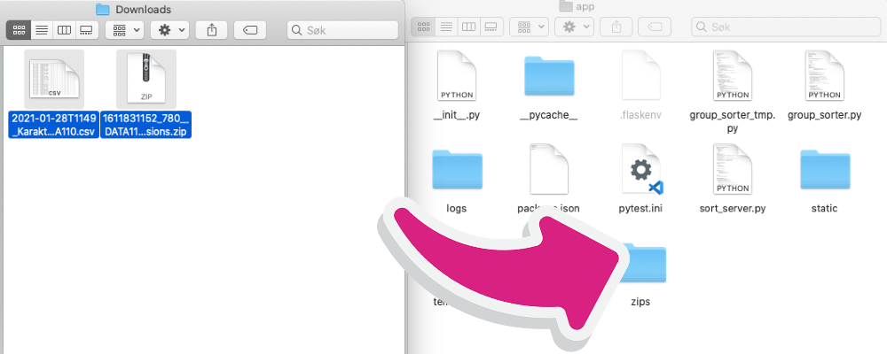

# Steps to install in local virtual environment

1. **Clone the repository:**  
`git clone <url>`

2. **Make a virtualenvironment, enter directory and activate the virtualenvironment:**  
`virtualenv assignment_view`  
`cd assignment_view`  
`source bin/activate`  

3. **Install requirements:**  
`pip install -r requirements.txt`  

4. **Export groups from Canvas (this you only need once pr semester):**  
  

5. **Download submissions from Canvas:**  
  

6. **Copy CSV and ZIP to zips folder in the app-directory:**  
  

---

7. **Now you should be able to run the program with:**  
`./run.sh`  

_Make sure `semester.json` is setup to the correct coursecode and number of groups._  
