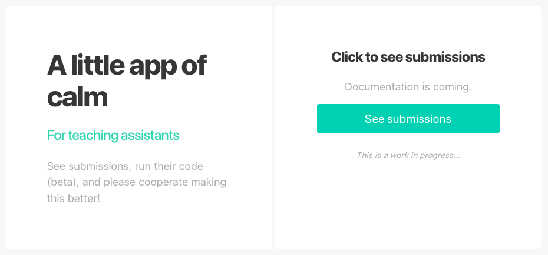
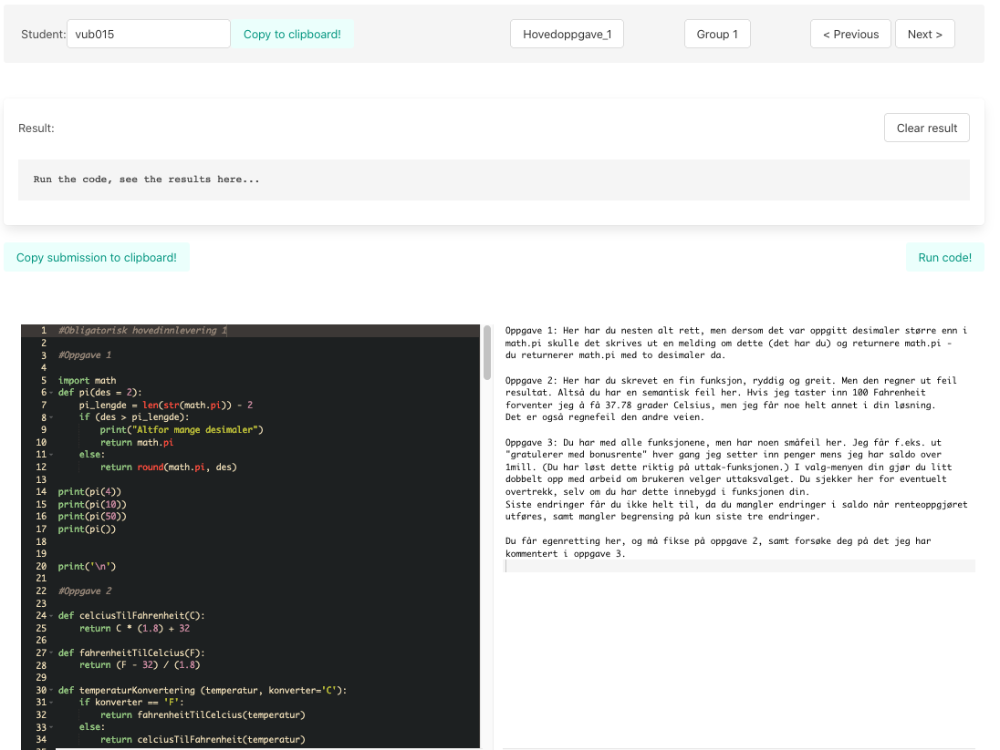

# What is this?
An approach to grade submissions from Canvas in a more fluent way, making it possible to run python code directly in the app.

# What does it look like?

---

---
# Steps to install in local virtual environment

1. **Clone the repository:**
`git clone <url>`

2. **Make a virtualenvironment, enter directory and activate the virtualenvironment:**
`virtualenv assignment_view`
`cd assignment_view`
`source bin/activate`

3. **Install requirements:**
`pip install -r requirements.txt`

4. **Make a test-key in your Canvas app**

5. **Store the key in .env_secret**

6. **Now you should be able to run the program with:**
`./run.sh`  OR if you are on windows:

## Windows:
`run_windows.cmd`
